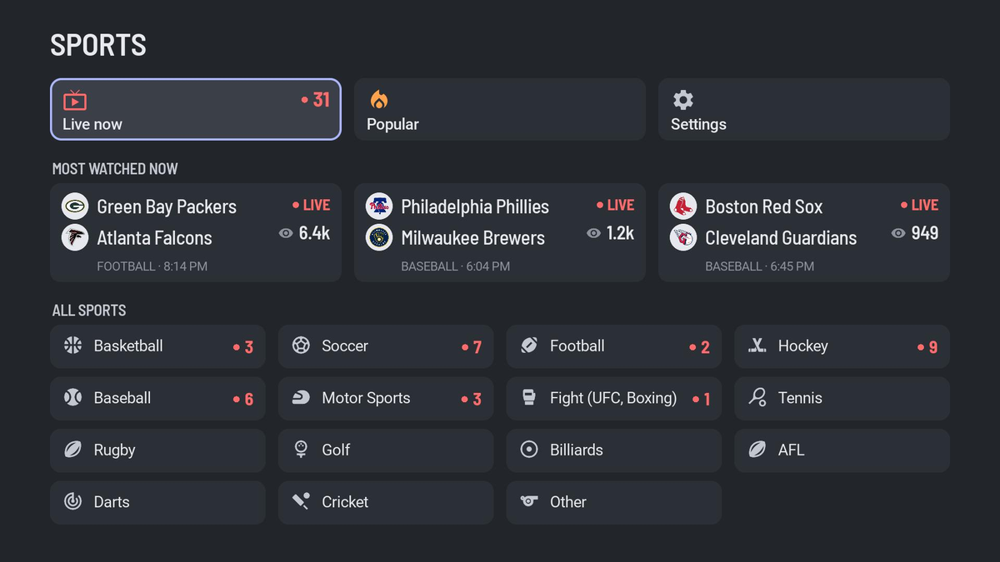
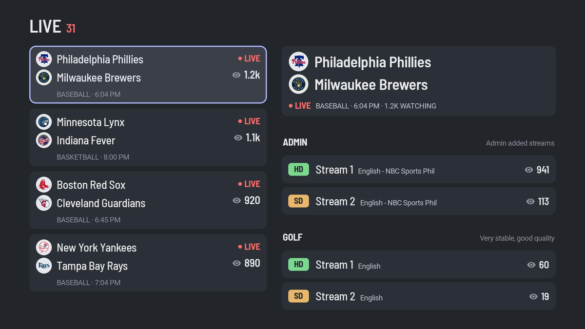

# The Sports App for Roku

A Roku version of the app: the same live games, sports and streams, laid out for a
TV and driven with the remote.

It needs one extra piece that the phone and desktop apps don't: a **stream
server** on your network. The streams only play after a web page has run its
code in a real Chrome, and a Roku can't do that itself, so a small Chrome service
does that part and the Roku plays the video. The video itself goes straight from
the stream's host to the Roku; the server only hands over the stream links.
(The details are in [DESIGN_NOTES.md](../DESIGN_NOTES.md#roku).)





## What you need

- A Roku in developer mode (steps below).
- A machine on the same network that can run a Docker container, to host the
  stream server.

## 1. Run the stream server

The stream server is the official Selenium standalone Chrome image, unchanged:

```bash
docker run -d --name selenium-chrome \
  -p 4444:4444 --shm-size=2g \
  -e SE_NODE_MAX_SESSIONS=4 -e SE_NODE_OVERRIDE_MAX_SESSIONS=true \
  -e SE_NODE_SESSION_TIMEOUT=300 \
  --restart unless-stopped \
  selenium/standalone-chrome:latest
```

- `--shm-size=2g`: Chrome crashes with Docker's default shared memory.
- `SE_NODE_MAX_SESSIONS=4`: one per TV that's playing (Selenium's default is 1).
- `SE_NODE_SESSION_TIMEOUT=300`: closes a session a Roku abandoned, e.g. when
  someone pressed Home mid-stream.

On **Unraid**, there's a template: add
`https://github.com/micahmo/docker-templates` to your template repositories and
install **SeleniumChrome**, or use the template file directly:
[selenium-chrome.xml](https://raw.githubusercontent.com/micahmo/docker-templates/master/micahmo/selenium-chrome.xml).
Use bridge networking.

`http://<server>:4444/ui` shows the server's status and any open sessions.

> Keep it on your local network. WebDriver has no authentication: anyone who
> can reach port 4444 can drive the browser. Don't forward the port or put it
> behind a public reverse proxy.

## 2. Put the Roku in developer mode

1. With the Roku's remote, press **Home ×3, Up ×2, Right, Left, Right, Left, Right**.
2. Enable the installer, accept the agreement and choose a password (the user
   name is always `rokudev`). The Roku restarts.
3. Note the IP address it shows (also in Settings → Network → About).

## 3. Install the app

Download `sports-roku-<version>.zip` from the
[latest release](https://github.com/micahmo/the_sports_app/releases/latest).
Don't unzip it.

**In a browser:** open `http://<roku-ip>`, sign in as `rokudev` with your
password, choose **Upload**, pick the zip and click **Install with zip**.

**Or from a terminal:**

```bash
curl --digest -u rokudev:<password> -F mysubmit=Install -F "archive=@sports-roku-<version>.zip" http://<roku-ip>/plugin_install
```

(On Windows PowerShell, type `curl.exe`: plain `curl` there is a different command.)

The app opens straight away and stays on the Roku's home screen as a developer
app. A Roku holds one developer app at a time, and turning developer mode off
removes it.

## 4. First launch

The app looks for the stream server on its own: it checks the Roku's network
for anything answering on port 4444 (or 9515, a plain ChromeDriver) and
remembers what it finds. If it can't find one, or the server moves, open
**Settings** on the home screen to scan again or type the address, e.g.
`http://192.168.1.20:4444`. **Test connection** there checks the server is up.

While a stream plays, **OK** shows the game and what the stream is actually
delivering (e.g. `1080p60 · 8.4 Mbps`); streams you've played show that on
their row in the list too.

## Troubleshooting

- **"Couldn't start a browser on …"**: the stream server isn't reachable. Check
  the container is running and **Test connection** in Settings.
- **"This stream is unavailable"**: the stream isn't broadcasting right now
  (common before a game starts). Try another stream or source.
- **Buffering**: the app reconnects by itself when a stream stalls, and waits
  for the connection if the internet drops. If it keeps failing it says so;
  pick another stream. Sources differ: `admin` has been the most reliable,
  and the 1080p ones (`foxtrot`, `hotel`) stall more often when the site's
  servers are busy.
- **`golf` streams never start**: known. That source hides its player inside
  other sites' pages, which the app can't reach (see DESIGN_NOTES.md).

## Development

The app is BrightScript/SceneGraph in [`app/`](app). Tooling needs Node and,
for deploying, Windows PowerShell:

```bash
cd roku
npm install
npm run check        # validate with BrighterScript
npm run package      # build out/sports.zip
npm run deploy       # build and install on your Roku
npm run screenshot   # save the Roku's screen to out/screen.jpg
```

`deploy` and `screenshot` read `ROKU_HOST`, `ROKU_DEV_PASSWORD` and optionally
`ROKU_DEV_USER` (default `rokudev`) from the environment, and pass the password
to curl on stdin, never on a command line.

- The app's images (icons, cards, splash) are generated from the Flutter app's
  assets by [`tools/make_assets.py`](tools/make_assets.py).
- The Roku's debug console, with the app's `print` output, is on port 8085:
  `telnet <roku-ip> 8085`.
- Retaking the screenshots above: see
  [docs/screenshots/README.md](../docs/screenshots/README.md#roku). Roku captures
  go black once an event poster has been on screen, so there's a routine.
- The app is a separate code base from the Flutter app; see DESIGN_NOTES.md
  before changing how streams are fetched.
